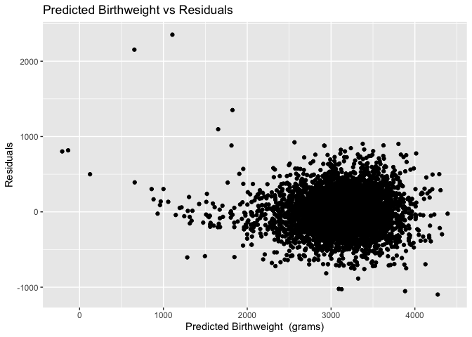
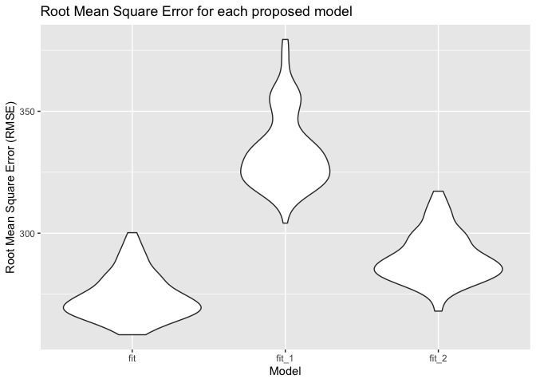

p8105\_hw6\_nja2140
================
Naina Ahuja

Problem 1: Load and clean the data for regression analysis (i.e. convert
numeric to factor where appropriate, check for missing data, etc.).

``` r
baby_data=
  read_csv("./Data/birthweight.csv") %>% 
  janitor::clean_names() %>%
  mutate(babysex = factor(babysex, levels =  c("1", "2"), labels = c("male", "female")),
         frace = factor(frace, levels =  c("1", "2", "3", "4", "8", "9"), labels = c("white", "black", "asian", "puerto rican", "other", "unknown")),
         malform = factor(malform, levels =  c("0", "1"), labels = c("absent", "present")),
         mrace = factor(mrace, levels =  c("1", "2", "3", "4", "8"), labels = c("white", "black", "asian", "puerto rican", "other"))
          )
```

    ## Parsed with column specification:
    ## cols(
    ##   .default = col_double()
    ## )

    ## See spec(...) for full column specifications.

``` r
baby_data
```

    ## # A tibble: 4,342 x 20
    ##    babysex bhead blength   bwt delwt fincome frace gaweeks malform menarche
    ##    <fct>   <dbl>   <dbl> <dbl> <dbl>   <dbl> <fct>   <dbl> <fct>      <dbl>
    ##  1 female     34      51  3629   177      35 white    39.9 absent        13
    ##  2 male       34      48  3062   156      65 black    25.9 absent        14
    ##  3 female     36      50  3345   148      85 white    39.9 absent        12
    ##  4 male       34      52  3062   157      55 white    40   absent        14
    ##  5 female     34      52  3374   156       5 white    41.6 absent        13
    ##  6 male       33      52  3374   129      55 white    40.7 absent        12
    ##  7 female     33      46  2523   126      96 black    40.3 absent        14
    ##  8 female     33      49  2778   140       5 white    37.4 absent        12
    ##  9 male       36      52  3515   146      85 white    40.3 absent        11
    ## 10 male       33      50  3459   169      75 black    40.7 absent        12
    ## # … with 4,332 more rows, and 10 more variables: mheight <dbl>,
    ## #   momage <dbl>, mrace <fct>, parity <dbl>, pnumlbw <dbl>, pnumsga <dbl>,
    ## #   ppbmi <dbl>, ppwt <dbl>, smoken <dbl>, wtgain <dbl>

Propose a regression model for birthweight. This model may be based on a
hypothesized structure for the factors that underly birthweight, on a
data-driven model-building process, or a combination of the two.
Describe your modeling process and show a plot of model residuals
against fitted values – use add\_predictions and add\_residuals in
making this plot.

To figure out the regression model for birthweight, I will run a
regression on each individual variable and see which is statistically
significantly associated with birthweight. Only the variables that are
statistically significant will be included in the regression model.

``` r
mp1 = lm(bwt ~ babysex, data = baby_data) %>% 
  broom::tidy() %>% 
  select(term, estimate, p.value) 
```

``` r
mp2 = lm(bwt ~ bhead, data = baby_data) %>% 
  broom::tidy() %>% 
  select(term, estimate, p.value) 
```

``` r
mp3 = lm(bwt ~ blength, data = baby_data) %>% 
  broom::tidy() %>% 
  select(term, estimate, p.value) 
```

``` r
mp4 = lm(bwt ~ delwt, data = baby_data) %>% 
  broom::tidy() %>% 
  select(term, estimate, p.value) 
```

``` r
mp5 = lm(bwt ~ fincome, data = baby_data) %>% 
  broom::tidy() %>% 
  select(term, estimate, p.value) 
```

``` r
mp6 = lm(bwt ~ frace, data = baby_data) %>% 
  broom::tidy() %>% 
  select(term, estimate, p.value) 
```

``` r
mp7 = lm(bwt ~ gaweeks, data = baby_data) %>% 
  broom::tidy() %>% 
  select(term, estimate, p.value) 
```

``` r
mp8 = lm(bwt ~ malform, data = baby_data) %>% 
  broom::tidy() %>% 
  select(term, estimate, p.value) 
```

``` r
mp9 = lm(bwt ~ menarche, data = baby_data) %>% 
  broom::tidy() %>% 
  select(term, estimate, p.value) 
```

``` r
mp10 = lm(bwt ~ mheight, data = baby_data) %>% 
  broom::tidy() %>% 
  select(term, estimate, p.value) 
```

``` r
mp11 = lm(bwt ~ momage, data = baby_data) %>% 
  broom::tidy() %>% 
  select(term, estimate, p.value) 
```

``` r
mp12 = lm(bwt ~ mrace, data = baby_data) %>% 
  broom::tidy() %>% 
  select(term, estimate, p.value) 
```

``` r
mp13 = lm(bwt ~ parity, data = baby_data) %>% 
  broom::tidy() %>% 
  select(term, estimate, p.value) 
```

``` r
mp14 = lm(bwt ~ pnumlbw, data = baby_data) %>% 
  broom::tidy() %>% 
  select(term, estimate, p.value) 
```

``` r
mp15 = lm(bwt ~ pnumsga, data = baby_data) %>% 
  broom::tidy() %>% 
  select(term, estimate, p.value) 
```

``` r
mp16 = lm(bwt ~ ppbmi, data = baby_data) %>% 
  broom::tidy() %>% 
  select(term, estimate, p.value) 
```

``` r
mp17 = lm(bwt ~ ppwt, data = baby_data) %>% 
  broom::tidy() %>% 
  select(term, estimate, p.value) 
```

``` r
mp18 = lm(bwt ~ smoken, data = baby_data) %>% 
  broom::tidy() %>% 
  select(term, estimate, p.value) 
```

``` r
mp19 = lm(bwt ~ wtgain, data = baby_data) %>% 
  broom::tidy() %>% 
  select(term, estimate, p.value) 
```

``` r
fit = lm(bwt ~ babysex + bhead + blength + delwt + fincome + frace + gaweeks + mheight + momage + mrace + pnumlbw + pnumsga + ppbmi + ppwt + smoken + wtgain, data = baby_data) 
fit
```

    ## 
    ## Call:
    ## lm(formula = bwt ~ babysex + bhead + blength + delwt + fincome + 
    ##     frace + gaweeks + mheight + momage + mrace + pnumlbw + pnumsga + 
    ##     ppbmi + ppwt + smoken + wtgain, data = baby_data)
    ## 
    ## Coefficients:
    ##       (Intercept)      babysexfemale              bhead  
    ##        -6281.3207            29.3063           130.8581  
    ##           blength              delwt            fincome  
    ##           74.9368             4.1510             0.2860  
    ##        fraceblack         fraceasian  fracepuerto rican  
    ##           12.9229            19.4755           -49.1603  
    ##        fraceother            gaweeks            mheight  
    ##            3.2709            11.2650             9.4318  
    ##            momage         mraceblack         mraceasian  
    ##            0.6932          -150.5937           -93.5611  
    ## mracepuerto rican            pnumlbw            pnumsga  
    ##          -55.8736                 NA                 NA  
    ##             ppbmi               ppwt             smoken  
    ##            4.3008            -3.4782            -4.8730  
    ##            wtgain  
    ##                NA

``` r
plot_1 = 
  baby_data %>% 
  modelr::add_residuals(fit) %>% 
  modelr::add_predictions(fit) %>% 
  ggplot(aes(x = pred, y = resid)) +
  geom_point () +
  labs(
    title = "Predicted Birthweight vs Residuals",
    x = "Predicted Birthweight  (grams)",
    y = "Residuals"
  )
```

    ## Warning in predict.lm(model, data): prediction from a rank-deficient fit
    ## may be misleading
    
    ## Warning in predict.lm(model, data): prediction from a rank-deficient fit
    ## may be misleading

``` r
plot_1
```

<!-- -->
Compare your model to two others:

One using length at birth and gestational age as predictors (main
effects only) One using head circumference, length, sex, and all
interactions (including the three-way interaction) between these

``` r
fit_1 = lm(bwt ~ blength + gaweeks, data = baby_data) %>% 
  broom::tidy() %>% 
  knitr::kable()
```

``` r
fit_2 = lm(bwt ~ bhead + blength + babysex + bhead*blength + bhead*babysex + babysex*blength + bhead*blength*babysex, data = baby_data) %>% 
  broom::tidy() %>% 
  knitr::kable()
```

Make this comparison in terms of the cross-validated prediction error;
use crossv\_mc and functions in purrr as appropriate.

``` r
cv_df = 
  crossv_mc(baby_data, 100) 

cv_df = 
  cv_df %>% 
  mutate(fit = map(train, ~lm(bwt ~ babysex + bhead + blength + delwt + fincome + frace + gaweeks + mheight + momage + mrace + pnumlbw + pnumsga + ppbmi + ppwt + smoken + wtgain, data = .x)),
         fit_1 = map(train, ~lm(bwt ~blength + gaweeks, data = .x)),
         fit_2 = map(train, ~lm(bwt ~ bhead + blength + babysex + bhead*blength + bhead*babysex + babysex*blength + bhead*blength*babysex, data = .x))) %>% 
  mutate(rmse_fit = map2_dbl(fit, test, ~rmse(model = .x, data = .y)),
         rmse_fit_1 = map2_dbl(fit_1, test, ~rmse(model = .x, data = .y)),
         rmse_fit_2 = map2_dbl(fit_2, test, ~rmse(model = .x, data = .y)))
```

    ## Warning in predict.lm(model, data): prediction from a rank-deficient fit
    ## may be misleading
    
    ## Warning in predict.lm(model, data): prediction from a rank-deficient fit
    ## may be misleading
    
    ## Warning in predict.lm(model, data): prediction from a rank-deficient fit
    ## may be misleading
    
    ## Warning in predict.lm(model, data): prediction from a rank-deficient fit
    ## may be misleading
    
    ## Warning in predict.lm(model, data): prediction from a rank-deficient fit
    ## may be misleading
    
    ## Warning in predict.lm(model, data): prediction from a rank-deficient fit
    ## may be misleading
    
    ## Warning in predict.lm(model, data): prediction from a rank-deficient fit
    ## may be misleading
    
    ## Warning in predict.lm(model, data): prediction from a rank-deficient fit
    ## may be misleading
    
    ## Warning in predict.lm(model, data): prediction from a rank-deficient fit
    ## may be misleading
    
    ## Warning in predict.lm(model, data): prediction from a rank-deficient fit
    ## may be misleading
    
    ## Warning in predict.lm(model, data): prediction from a rank-deficient fit
    ## may be misleading
    
    ## Warning in predict.lm(model, data): prediction from a rank-deficient fit
    ## may be misleading
    
    ## Warning in predict.lm(model, data): prediction from a rank-deficient fit
    ## may be misleading
    
    ## Warning in predict.lm(model, data): prediction from a rank-deficient fit
    ## may be misleading
    
    ## Warning in predict.lm(model, data): prediction from a rank-deficient fit
    ## may be misleading
    
    ## Warning in predict.lm(model, data): prediction from a rank-deficient fit
    ## may be misleading
    
    ## Warning in predict.lm(model, data): prediction from a rank-deficient fit
    ## may be misleading
    
    ## Warning in predict.lm(model, data): prediction from a rank-deficient fit
    ## may be misleading
    
    ## Warning in predict.lm(model, data): prediction from a rank-deficient fit
    ## may be misleading
    
    ## Warning in predict.lm(model, data): prediction from a rank-deficient fit
    ## may be misleading
    
    ## Warning in predict.lm(model, data): prediction from a rank-deficient fit
    ## may be misleading
    
    ## Warning in predict.lm(model, data): prediction from a rank-deficient fit
    ## may be misleading
    
    ## Warning in predict.lm(model, data): prediction from a rank-deficient fit
    ## may be misleading
    
    ## Warning in predict.lm(model, data): prediction from a rank-deficient fit
    ## may be misleading
    
    ## Warning in predict.lm(model, data): prediction from a rank-deficient fit
    ## may be misleading
    
    ## Warning in predict.lm(model, data): prediction from a rank-deficient fit
    ## may be misleading
    
    ## Warning in predict.lm(model, data): prediction from a rank-deficient fit
    ## may be misleading
    
    ## Warning in predict.lm(model, data): prediction from a rank-deficient fit
    ## may be misleading
    
    ## Warning in predict.lm(model, data): prediction from a rank-deficient fit
    ## may be misleading
    
    ## Warning in predict.lm(model, data): prediction from a rank-deficient fit
    ## may be misleading
    
    ## Warning in predict.lm(model, data): prediction from a rank-deficient fit
    ## may be misleading
    
    ## Warning in predict.lm(model, data): prediction from a rank-deficient fit
    ## may be misleading
    
    ## Warning in predict.lm(model, data): prediction from a rank-deficient fit
    ## may be misleading
    
    ## Warning in predict.lm(model, data): prediction from a rank-deficient fit
    ## may be misleading
    
    ## Warning in predict.lm(model, data): prediction from a rank-deficient fit
    ## may be misleading
    
    ## Warning in predict.lm(model, data): prediction from a rank-deficient fit
    ## may be misleading
    
    ## Warning in predict.lm(model, data): prediction from a rank-deficient fit
    ## may be misleading
    
    ## Warning in predict.lm(model, data): prediction from a rank-deficient fit
    ## may be misleading
    
    ## Warning in predict.lm(model, data): prediction from a rank-deficient fit
    ## may be misleading
    
    ## Warning in predict.lm(model, data): prediction from a rank-deficient fit
    ## may be misleading
    
    ## Warning in predict.lm(model, data): prediction from a rank-deficient fit
    ## may be misleading
    
    ## Warning in predict.lm(model, data): prediction from a rank-deficient fit
    ## may be misleading
    
    ## Warning in predict.lm(model, data): prediction from a rank-deficient fit
    ## may be misleading
    
    ## Warning in predict.lm(model, data): prediction from a rank-deficient fit
    ## may be misleading
    
    ## Warning in predict.lm(model, data): prediction from a rank-deficient fit
    ## may be misleading
    
    ## Warning in predict.lm(model, data): prediction from a rank-deficient fit
    ## may be misleading
    
    ## Warning in predict.lm(model, data): prediction from a rank-deficient fit
    ## may be misleading
    
    ## Warning in predict.lm(model, data): prediction from a rank-deficient fit
    ## may be misleading
    
    ## Warning in predict.lm(model, data): prediction from a rank-deficient fit
    ## may be misleading
    
    ## Warning in predict.lm(model, data): prediction from a rank-deficient fit
    ## may be misleading
    
    ## Warning in predict.lm(model, data): prediction from a rank-deficient fit
    ## may be misleading
    
    ## Warning in predict.lm(model, data): prediction from a rank-deficient fit
    ## may be misleading
    
    ## Warning in predict.lm(model, data): prediction from a rank-deficient fit
    ## may be misleading
    
    ## Warning in predict.lm(model, data): prediction from a rank-deficient fit
    ## may be misleading
    
    ## Warning in predict.lm(model, data): prediction from a rank-deficient fit
    ## may be misleading
    
    ## Warning in predict.lm(model, data): prediction from a rank-deficient fit
    ## may be misleading
    
    ## Warning in predict.lm(model, data): prediction from a rank-deficient fit
    ## may be misleading
    
    ## Warning in predict.lm(model, data): prediction from a rank-deficient fit
    ## may be misleading
    
    ## Warning in predict.lm(model, data): prediction from a rank-deficient fit
    ## may be misleading
    
    ## Warning in predict.lm(model, data): prediction from a rank-deficient fit
    ## may be misleading
    
    ## Warning in predict.lm(model, data): prediction from a rank-deficient fit
    ## may be misleading
    
    ## Warning in predict.lm(model, data): prediction from a rank-deficient fit
    ## may be misleading
    
    ## Warning in predict.lm(model, data): prediction from a rank-deficient fit
    ## may be misleading
    
    ## Warning in predict.lm(model, data): prediction from a rank-deficient fit
    ## may be misleading
    
    ## Warning in predict.lm(model, data): prediction from a rank-deficient fit
    ## may be misleading
    
    ## Warning in predict.lm(model, data): prediction from a rank-deficient fit
    ## may be misleading
    
    ## Warning in predict.lm(model, data): prediction from a rank-deficient fit
    ## may be misleading
    
    ## Warning in predict.lm(model, data): prediction from a rank-deficient fit
    ## may be misleading
    
    ## Warning in predict.lm(model, data): prediction from a rank-deficient fit
    ## may be misleading
    
    ## Warning in predict.lm(model, data): prediction from a rank-deficient fit
    ## may be misleading
    
    ## Warning in predict.lm(model, data): prediction from a rank-deficient fit
    ## may be misleading
    
    ## Warning in predict.lm(model, data): prediction from a rank-deficient fit
    ## may be misleading
    
    ## Warning in predict.lm(model, data): prediction from a rank-deficient fit
    ## may be misleading
    
    ## Warning in predict.lm(model, data): prediction from a rank-deficient fit
    ## may be misleading
    
    ## Warning in predict.lm(model, data): prediction from a rank-deficient fit
    ## may be misleading
    
    ## Warning in predict.lm(model, data): prediction from a rank-deficient fit
    ## may be misleading
    
    ## Warning in predict.lm(model, data): prediction from a rank-deficient fit
    ## may be misleading
    
    ## Warning in predict.lm(model, data): prediction from a rank-deficient fit
    ## may be misleading
    
    ## Warning in predict.lm(model, data): prediction from a rank-deficient fit
    ## may be misleading
    
    ## Warning in predict.lm(model, data): prediction from a rank-deficient fit
    ## may be misleading
    
    ## Warning in predict.lm(model, data): prediction from a rank-deficient fit
    ## may be misleading
    
    ## Warning in predict.lm(model, data): prediction from a rank-deficient fit
    ## may be misleading
    
    ## Warning in predict.lm(model, data): prediction from a rank-deficient fit
    ## may be misleading
    
    ## Warning in predict.lm(model, data): prediction from a rank-deficient fit
    ## may be misleading
    
    ## Warning in predict.lm(model, data): prediction from a rank-deficient fit
    ## may be misleading
    
    ## Warning in predict.lm(model, data): prediction from a rank-deficient fit
    ## may be misleading
    
    ## Warning in predict.lm(model, data): prediction from a rank-deficient fit
    ## may be misleading
    
    ## Warning in predict.lm(model, data): prediction from a rank-deficient fit
    ## may be misleading
    
    ## Warning in predict.lm(model, data): prediction from a rank-deficient fit
    ## may be misleading
    
    ## Warning in predict.lm(model, data): prediction from a rank-deficient fit
    ## may be misleading
    
    ## Warning in predict.lm(model, data): prediction from a rank-deficient fit
    ## may be misleading
    
    ## Warning in predict.lm(model, data): prediction from a rank-deficient fit
    ## may be misleading
    
    ## Warning in predict.lm(model, data): prediction from a rank-deficient fit
    ## may be misleading
    
    ## Warning in predict.lm(model, data): prediction from a rank-deficient fit
    ## may be misleading
    
    ## Warning in predict.lm(model, data): prediction from a rank-deficient fit
    ## may be misleading
    
    ## Warning in predict.lm(model, data): prediction from a rank-deficient fit
    ## may be misleading
    
    ## Warning in predict.lm(model, data): prediction from a rank-deficient fit
    ## may be misleading
    
    ## Warning in predict.lm(model, data): prediction from a rank-deficient fit
    ## may be misleading
    
    ## Warning in predict.lm(model, data): prediction from a rank-deficient fit
    ## may be misleading
    
    ## Warning in predict.lm(model, data): prediction from a rank-deficient fit
    ## may be misleading

``` r
cv_df %>% 
  select(starts_with("rmse")) %>% 
  pivot_longer(
    everything (),
    names_to = "model", 
    values_to = "rmse", 
    names_prefix = "rmse_") %>% 
  mutate(model - fct_inorder(model)) %>% 
  ggplot(aes(x = model, y = rmse)) +
  geom_violin () 
```

    ## Warning in Ops.factor(model, fct_inorder(model)): '-' not meaningful for
    ## factors

<!-- -->
From this plot, we can see model 3 is the best.

Problem 2: Download the data

``` r
weather_df = 
  rnoaa::meteo_pull_monitors(
    c("USW00094728"),
    var = c("PRCP", "TMIN", "TMAX"), 
    date_min = "2017-01-01",
    date_max = "2017-12-31") %>%
  mutate(
    name = recode(id, USW00094728 = "CentralPark_NY"),
    tmin = tmin / 10,
    tmax = tmax / 10) %>%
  select(name, id, everything())
```

    ## Registered S3 method overwritten by 'crul':
    ##   method                 from
    ##   as.character.form_file httr

    ## Registered S3 method overwritten by 'hoardr':
    ##   method           from
    ##   print.cache_info httr

    ## file path:          /Users/nainaahuja/Library/Caches/rnoaa/ghcnd/USW00094728.dly

    ## file last updated:  2019-09-26 07:26:09

    ## file min/max dates: 1869-01-01 / 2019-09-30

We’ll focus on a simple linear regression with tmax as the response and
tmin as the predictor, and are interested in the distribution of two
quantities estimated from these data. Use 5000 bootstrap samples and,
for each bootstrap sample, produce estimates of these two quantities.

``` r
lm(tmax ~ tmin, data = weather_df) %>% 
  broom::tidy()
```

    ## # A tibble: 2 x 5
    ##   term        estimate std.error statistic   p.value
    ##   <chr>          <dbl>     <dbl>     <dbl>     <dbl>
    ## 1 (Intercept)     7.21    0.226       31.8 3.81e-107
    ## 2 tmin            1.04    0.0170      61.2 2.98e-193

``` r
boot_straps =
  weather_df %>% 
  modelr::bootstrap(n = 5000) 
```

``` r
coeff =
  weather_df %>% 
  modelr::bootstrap(n = 5000) %>% 
  mutate(models = map(strap, ~lm(tmax ~ tmin, data = .x)),
         results = map(models, broom::tidy)) %>% 
  select(-strap, -models) %>% 
  unnest(results) %>% 
  group_by(.id) %>% 
  summarize(log_coef = sum(log(estimate))) %>% 
  summarize(low_int = quantile(log_coef, 0.025), up_int = quantile(log_coef, .975))
coeff
```

    ## # A tibble: 1 x 2
    ##   low_int up_int
    ##     <dbl>  <dbl>
    ## 1    1.97   2.06

``` r
r_squared =
  weather_df %>% 
  modelr::bootstrap(n = 5000) %>% 
  mutate(models = map(strap, ~lm(tmax ~ tmin, data = .x)),
         results = map(models, broom::glance)) %>% 
  select(-strap, -models) %>% 
  unnest(results) %>% 
  summarize(low_int = quantile(r.squared, 0.025), up_int = quantile(r.squared, .975))
r_squared
```

    ## # A tibble: 1 x 2
    ##   low_int up_int
    ##     <dbl>  <dbl>
    ## 1   0.894  0.927

Plot the distribution of your estimates, and describe these in words.
